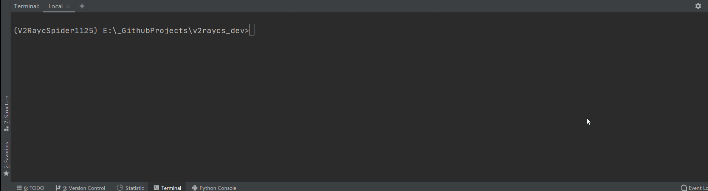

## Scaffold Decouple

1. 发起一次对活跃订阅池的`失效订阅剔除`任务。探测节点服务器的`摘要信息`，通过简单的决策流程判断节点源状态，进而决定链接去留。满足以下任一条件的实例将被剔除：
   - 订阅指向的节点无一可用；
   - 无法正常连接目标服务器（接口关闭或服务瘫痪）；
   - 订阅无可用流量；

2. V2RSS 允许多台服务器指向同一个订阅池执行 decouple 任务。





