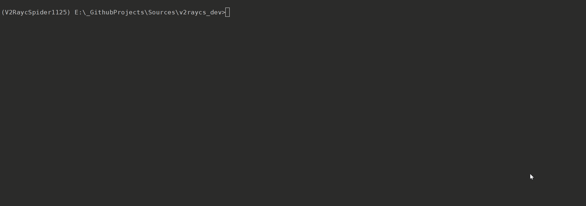
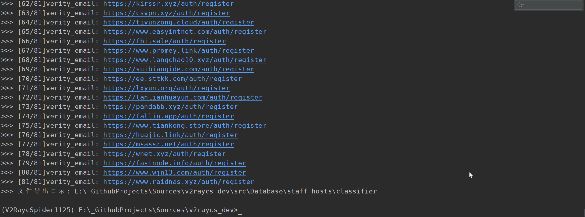

## Scaffold Mining

### NAME

main.py mining -  采集、清洗、分类、存储暴露在公网上的 `SSPanel-Uim` 站点。

### SYNOPSIS

```bash
 main.py mining <flags>
```

### DESCRIPTION



📌 详见分支项目 [SSPanel-Mining](https://github.com/QIN2DIM/sspanel-mining)。





📌 访客可在 [运行缓存](https://github.com/RobAI-Lab/sspanel-mining/tree/main/src/database/sspanel_hosts/classifier) 中阅览分类结果。



基础用法如下：

```python
Usage: python main.py mining
______________________________________________________________________
or: python main.py mining --env=production                |在 GitHub Actions 中构建生产环境
or: python main.py mining --silence=False                 |显式启动，在 linux 中运行时无效
or: python main.py mining --power=4                       |指定分类器运行功率
or: python main.py mining --classifier --source=local     |启动分类器，指定数据源为本地缓存
or: python main.py mining --classifier --source=remote    |启动分类器，指定远程数据源
or: python main.py mining --collector                     |启动采集器
______________________________________________________________________
```

### FLAGS

- env=ENV

  - Type: str

  - Default: 'development'

    Must be within [development production]

- silence=SILENCE

  - Type: bool

  - Default: True

    采集器静默启动。

- power=POWER

  - Type: int

  - Default: 16

    分类器运行功率。

- collector=COLLECTOR

  - Type: bool

  - Default: False

    采集器运行权限。

- classifier=CLASSIFIER

  - Type: bool

  - Default: False

    分类器控制权限。

- source=SOURCE

  - Type: str

  - Default: 'local'

    该参数仅对分类器生效，Must be within [local remote] 用于指定数据源。

    - `local`：使用本地 Collector 采集的数据进行分类 ；
    - `remote`：使用 SSPanel-Mining 母仓库数据进行分类（需要下载数据集）。

- batch=BATCH

  - Type: int

  - Default: 1

    batch 应是大于零的自然数，该参数仅在 `source==remote` 时生效，用于指定拉取的数据范围。

    - `batch=1` 表示拉取昨天的数据（默认）；
    - `batch=2` 表示拉取昨天+前天的数据，以此类推往前堆叠 
    - 显然，当设置的 batch 大于母仓库存储量时会自动截停运行逻辑，防止溢出。

### DEMO












