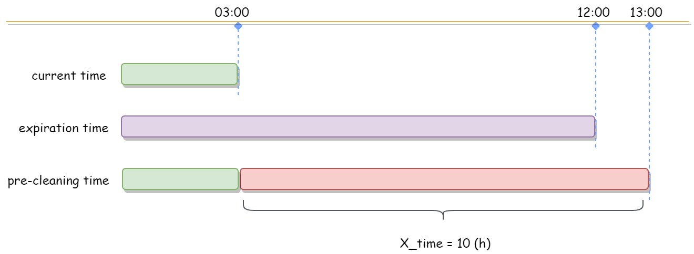
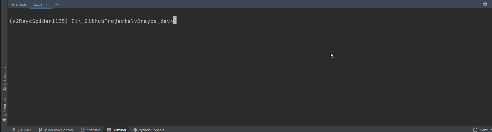

## Scaffold Overdue

1. 发起一次向活跃订阅池的`过时订阅清洗`任务。
   - 订阅入池时会被“人为”标注过期时间(expiration time)，此时间点严格对齐订阅源提供的免费使用时长。
   - 执行`overdue`时存在`预清洗`操作，既若设定预清洗时长(pre-cleaning time)，则清洗目标的`过期时间`与任务发起时间点(`当前时间`)的距离小于或等于X时就会被清除，而非是过期时间小于或等于当前时间。预清洗参数让订阅分发更加科学，杜绝用户端”刚拿到手“就过期的极端情况。
   - `Scaffold overdue pre-cleaning time` 预清洗时长默认为6小时，既当任务发起时，可用市场不足6小时的链接将被剔除。

2. 打印信息中包含信息有`订阅类型`及对应类型的`存活数量`。




