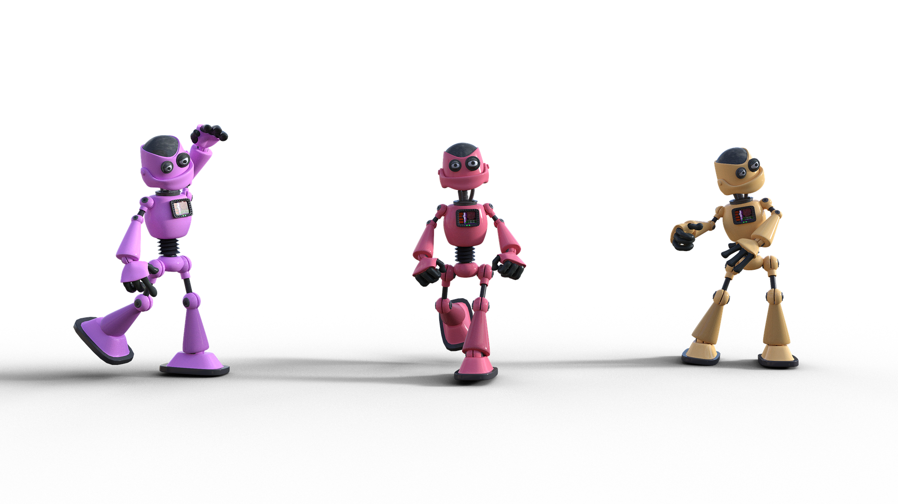

# The bot revolution: Chatbots in automation

## Introduction to Chatbots

「机器能否思考」这个问题历史悠久，早在1950年就已经存在，[Alan Mathison Turing](https://baike.baidu.com/item/%E8%89%BE%E4%BC%A6%C2%B7%E9%BA%A6%E5%B8%AD%E6%A3%AE%C2%B7%E5%9B%BE%E7%81%B5/3940576) 提出了[图灵测试](https://zh.wikipedia.org/wiki/%E5%9B%BE%E7%81%B5%E6%B5%8B%E8%AF%95)，用于测试机器能否表现出与人等价或无法区分的[智能](https://zh.wikipedia.org/wiki/智能)。这一概念的现代应用常被用来帮助简化人类与信息系统之间的互动。

「[聊天机器人](https://zh.wikipedia.org/wiki/%E8%81%8A%E5%A4%A9%E6%A9%9F%E5%99%A8%E4%BA%BA)」是一种能够模拟人类对话，与人类通过富文本或语音进行在线聊天对话的软件应用程序。在不断增长的数字世界中，聊天机器人已能生产环境中替代人类完成耗时的、繁琐的任务，如[客户服务](https://baike.sogou.com/v66630.htm?ch=zhihu.topic)或资讯获取。

在顶层设计上，我们最常接触到的聊天机器人都具有两种属性，基于规则的应答和基于 NLP 的应答。

我们常见的群管理机器人都是基于规则的，它们的发言与其说是「交流」更像是「Response」，旨在以人们喜闻乐见的形式传达「指令已完成」的信号。

真正意义上的「聊天机器人」是极其罕见的。绝大多多数具备闲聊能力的聊天机器人，都只将聊天功能作为外部请求的响应式玩具。意味着许多投放在生产中的聊天机器人仍然无法正常地与人类进行对话。

## Rules-based Chatbots

「响应式聊天机器人」也称基于规则的聊天机器人，它遵循预先确定的规则，常被用于功能性的引导场景。这是一个类似于流程图的过程，具有不同程度的复杂性，能够通过用户的输入获取一个映射结果。

## Live Chatbots

「即时聊天机器人」常被用以代替销售和技术支持团队实时回答问题。NLP 赋能的聊天机器人，可以更智能地理解用户的口语和输入问题，也能让我们实现效果更佳的拟人多轮对话。这个新领域的成效远远超出了基于规则的响应式聊天机器人。

## Limitations of Chatbots

聊天机器人仍然是一个与人工智能和机器学习有很大关系的发展中的领域，因此其在功能和使用案例方面有一些难以处理的限制：

- 由于用于生成输出的数据库是固定和有限的，响应式聊天机器人在处理未知问题时可能会失败。

- 聊天机器人的工作效率高度依赖于语言处理，在语音对话中常受用户口音和口误等非范式行为的限制。

- 行业领先的聊天机器人已能在生产中处理多轮对话问题（通常认为「聊得越久越智能」），但仍无法很好地处理用户同时抛出的多个问题。

  - 业界关于一对多分支对话的解决方案各有千秋，而大多数投放于生产环境的聊天机器人用于特种领域（如上文所述），能于开放领域中与来自不同语言不同文化地区的人类对话的聊天机器人风毛菱角，效果差强人意。

- 性能优异的聊天机器人通常需要大量优质的对话数据来训练，所以目前行业中流行着「几家产品」与「一堆玩具」的诙谐盛况。

- 常规的聊天机器人难以管理非线性对话，必须与用户在同一类（个）话题上来回对话。

  目前，「全双工开放式领域对话」是一个行业领先的实践方案，但其依赖的动态回复与平行处理机制较为复杂，难以复现。

- 数据安全问题，主要来自数据污染（诱导）和接口爆破。
