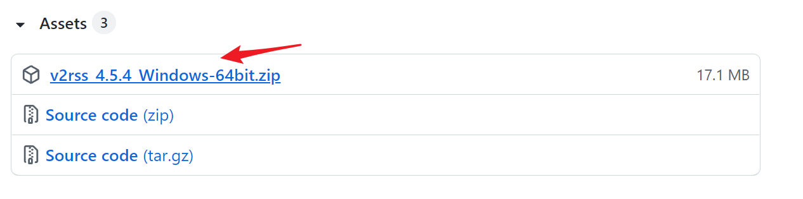

## **下载资源**



📌 云彩姬仅作 [demo](/docs/user/v2rss-cli/toc#其他声明) 使用，目前仅提供 Windows 发行客户端，暂无开发跨平台客户端的想法。



以你喜欢的方式拉取 [V2RayCloudSpider 项目仓库](https://github.com/QIN2DIM/V2RayCloudSpider/releases) 最新版本的发行客户端。下载解压获取 `.exe` 单体程序，双击运行既可启动云彩姬本姬。





若您无法访问 GitHub 或不幸失联，也可以使用 CFW 反向代理加速下载。点击下方 `Download` 按钮既可加速下载 `V2RSS云彩姬 v4.5.4` 客户端，之后可通过软体内置模块拉取最新版本特性。



Download



