## 订阅链接「快速获取」



📌 部分订阅源拒绝国内 IP 访问，需要使用代理才能正常更新订阅。



在 `Home` 首页下，（以获取 V2Ray 订阅链接为例）依次选择 `[2]获取订阅链接`  `[1]V2Ray订阅链接` 既可获取订阅，如下图所示：



<image src="Snipaste_2021-10-09_09-24-30.png" style="zoom:67%" alt="云彩姬 Home">

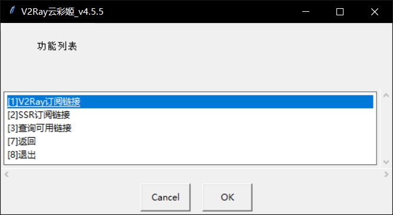



本组件需联网使用，下图为「获取成功」的界面，点击 <kbd>OK</kbd>  既可自动复制链接。



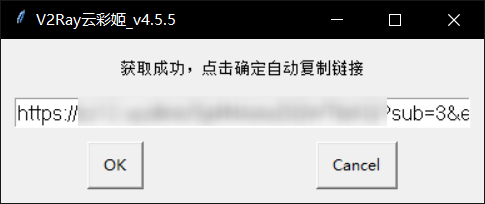



打开你喜欢的图形客户端，按下 <kbd>Ctrl</kbd> + <kbd>V</kbd> 既可自动添加订阅链接，更新订阅后既可拉取订阅映射的节点列表。

> 云彩姬支持主流协议订阅的采集，其他类型订阅的快速获取方法均可类比。

## 订阅链接「查询获取」



📌 在上一步方案中，快速获取的订阅由上游服务随机分发，而云彩姬允许使用者选取订阅。



在`Home`首页下，依次选择`[2]获取订阅链接`->`[4]查询可用链接`，即可弹出下图所示界面。



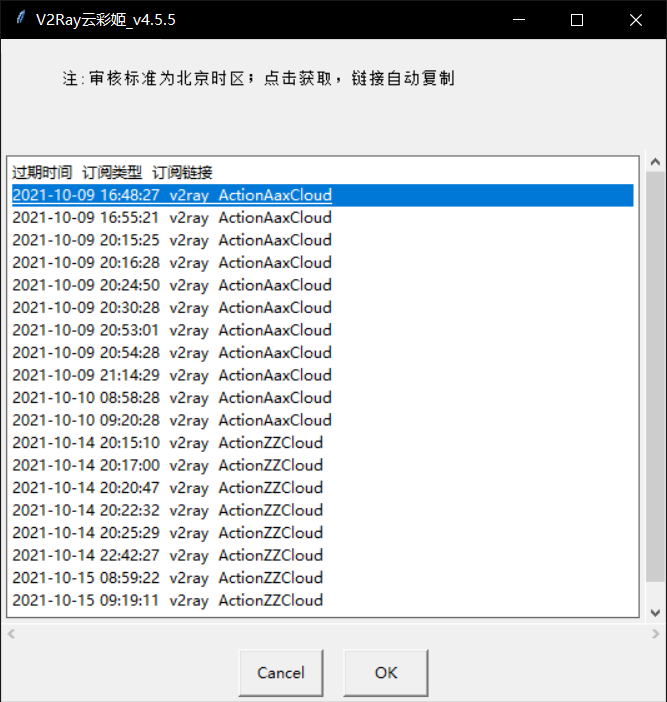



此窗格由 3 部分信息组成，分别为「过期时间」「订阅类型」以及「订阅别名」，过期时间以 `Asia/Shanghai` 为准。

V2RSS 分发的订阅从服务上游开始被层层清洗，输送到使用者手中的订阅已被打上各种价值标签。使用云彩姬分发的订阅，使用者可以明确知道节点的过期时间与可用流量，而无需自建复杂的定时清洗任务，也无需亲自维护价值密度极低的代理节点池。

云彩姬将代理节点的分发行为降至零门槛，用户只要正常打开软体，几乎只需点击「下一步」就能获取到经过上游服务层层清洗的高质量订阅链接。

## 查看「访问历史」

这是个不常用的功能，主要用于解决一些棘手的需求场景 。例如用户在「获取成功」界面点击 <kbd>OK</kbd> 后，相关信息会自动流入剪贴板而后窗体自行消解，若此时有其他信息混入剪贴板，使用者又不知道如何查看剪贴板历史时，可使用「查看访问历史」功能捕获游离的数据。

在`Home`首页下，选择 `[3]打开本地文件` 查看历史请求记录。



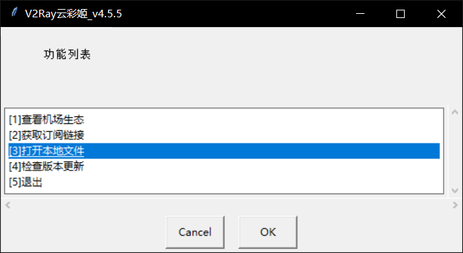

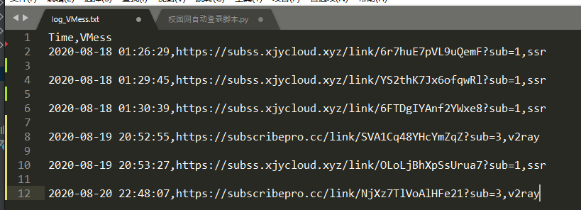
			



## 查看「机场生态」



📌 云彩姬内置高性能抓取模块，能够充分利用本地网络资源采集机场生态。





📌 因不可抗力因素此插件不再更新。



**获取数据**

在 `Home` 首页下，依次选择`[1]查看机场生态`，`[any]`，`[1]查看`，既可查看 `free/vip/all` 三个层级的数据，选中项目并敲下 <kbd>Enter</kbd> 使用默认浏览器访问对应提供商的注册页面（部分网站需要代理访问）。



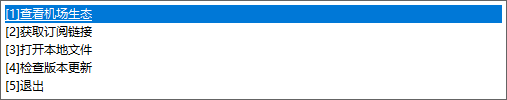

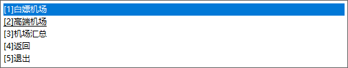

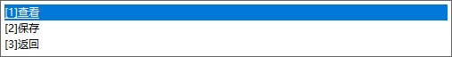

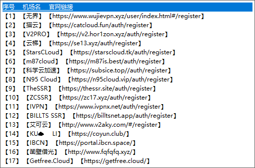

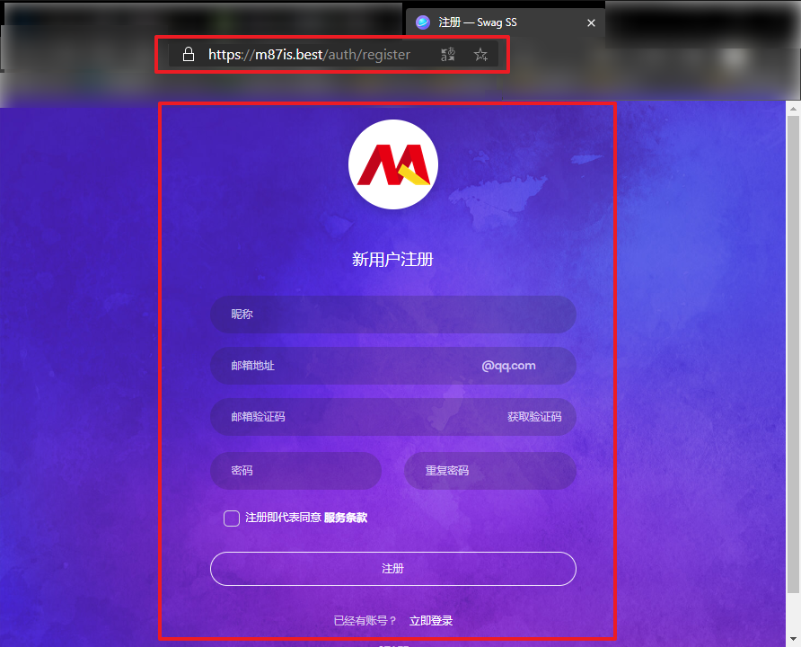



**保存数据**

在 `Home` 首页下，依次选择 `[1]查看机场生态`，`[any]`，`[2]保存`，既可保存 `free/vip/all` 三个层级的对应信息。



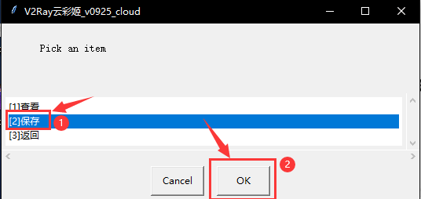

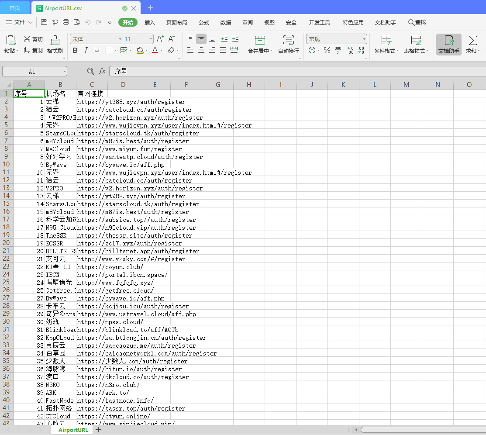


