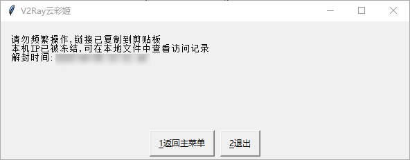

## 注意事项

### 进程冻结



📌 云彩姬会主动限制用户的请求频率。



软件内置的进程锁函数将综合 <u>本地请求历史</u> 与 <u>服务时区残差</u> 等多种因素锁死进程。封禁时间一般位于 15~45s 之间。





### **其他声明**



- 云彩姬是一个由维护者提供的用于项目演示的 demo，并不是一个成熟的生产工具。
- 若您在使用过程中遇到 <u>响应迟钝</u>，<u>窗体消失</u> 等问题，请检查您当前的网络状况，等待数秒后仍无响应请重启软件。

- 若无特殊需求，本项目 `Panel` （云彩姬）将不再升级或更新，其余项目进度将在[Projects](https://github.com/QIN2DIM/V2RayCloudSpider/projects) 中公示。

- 无论是使用过程中遇到的困难，还是有关本项目的需求建议，您都可以在 [`issue`](https://github.com/QIN2DIM/V2RayCloudSpider/issues/new/choose) 中留言。


