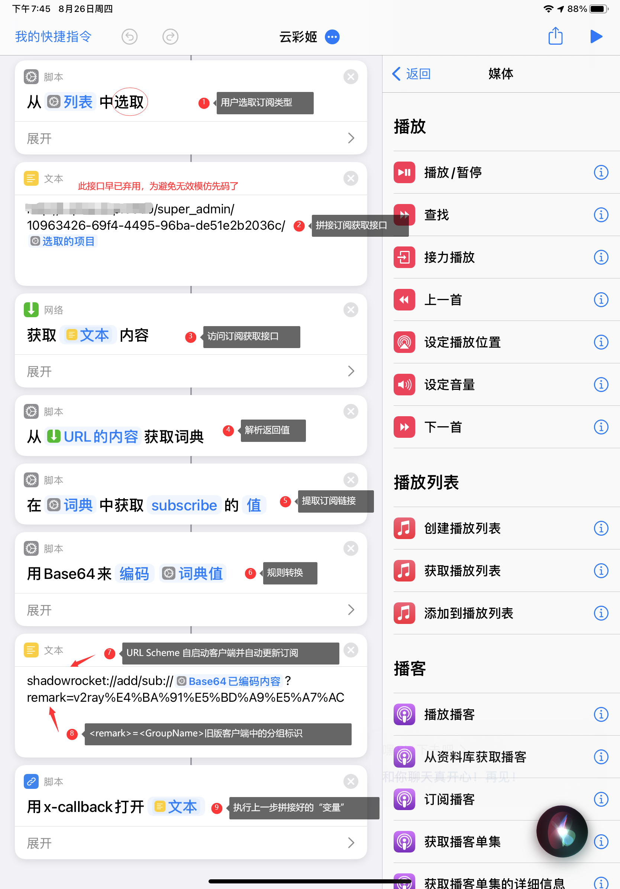

## V2RSS Shortcut

- 「云彩姬捷径」（V2RSS Shortcut）是一个基于[捷径指令](https://zh.wikipedia.org/wiki/%E5%BF%AB%E6%8D%B7%E6%8C%87%E4%BB%A4)+ [Shadowrocket URL Scheme](https://sharecuts.cn/app/932747118) 的订阅链接瞬时获取解决方案。

- V2RSS 上游服务提供了一整套完备的订阅分发接口，iOS 用户仅需通过「云彩姬捷径」实现简单的 RPC 通信，便可拉取经过层层清洗的优质订阅节点。

- 「云彩姬捷径」共有 3 个大步骤，分别是接口请求，返回值清洗以及自启 Shadowrocket 并自动更新订阅。

## Demo



📌 若 shortcode 无法加载请访问 [备用链接](https://www.yuque.com/docs/share/cb2105c2-7d0f-4f98-a909-70d01c2f5896?)。





## Quick Start

下图为「云彩姬捷径」的模板代码。





📌 为防止滥用，模板 步骤2 的测试接口已被隐去，用户若想使用属于自己的捷径指令，需要自行部署 V2RSS 上游服务。





